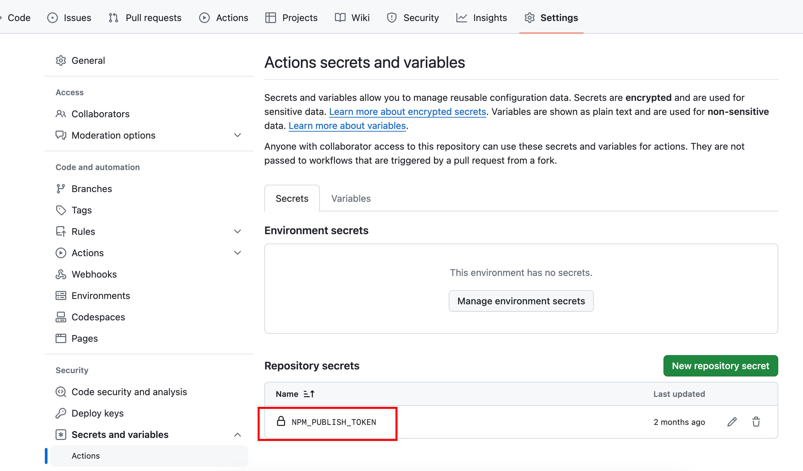

# React Hook Package Template

- Build with [tsup](https://tsup.egoist.dev/)
- Publish to npm with github actions

## Prepare

Update package.json with your package `name`, `description`, `keywords`, `author`, `repository`, etc.

For example:

- package name: `react-use-my-hook`
- description: `A react hook package`
- keywords: `["react", "hook", "your-keyword"]`
- author: `John`
- repository: `https://github.com/john/react-use-my-hook.git`

```diff
  {
--  "name": "package-name",
++  "name": "react-use-my-hook",
    "version": "0.0.1",
--  "description": "<description>",
++  "description": "A react hook package",
    "main": ".dist/index.js",
    "types": ".dist/index.d.ts",
    "files": [
      ".dist"
    ],
    "keywords": [
      "react",
--    "hook"
++    "hook",
++    "your-keyword"
    ],
--  "author": "<author name>",
++  "author": "John",
    "license": "MIT",
    "peerDependencies": {
      "react": ">=16.8.0",
      "react-dom": ">=16.8.0"
    },
    "devDependencies": {
      "@testing-library/dom": "^10.4.0",
      "@testing-library/jest-dom": "^6.6.3",
      "@testing-library/react": "^16.1.0",
      "@types/react": ">=16.8.0",
      "@types/react-dom": ">=16.8.0",
      "happy-dom": "^16.5.3",
      "react": ">=16.8.0",
      "react-dom": ">=16.8.0",
      "tsup": "^8.0.2",
      "typescript": "^5.4.5",
      "typescript": "^5.4.5",
      "vitest": "^2.1.8"
    },
    "repository": {
      "type": "git",
--    "url": "<your repo url>"
++    "url": "https://github.com/john/react-use-my-hook.git"
    },
    "scripts": {
      "test": "vitest",
      "build": "tsup"
    }
  }

```

## Build

```bash
pnpm build
```

## Test

```bash
pnpm test
```

## Publish

Add a [github secret](https://docs.github.com/en/actions/security-guides/using-secrets-in-github-actions) `NPM_PUBLISH_TOKEN` with your [npm access token](https://docs.npmjs.com/about-access-tokens).



Draft a new release on github, then the github actions will publish the package to npm.
